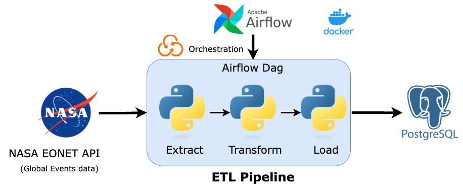

# 🚀 ETL Pipeline for Real-Time Global Event Tracking using NASA API & Apache Airflow

This repository contains a complete ETL pipeline that fetches natural event data from the [NASA EONET API](https://eonet.gsfc.nasa.gov/api/v3/events) and loads it into a PostgreSQL database using **Apache Airflow** and **PostgresHook**.

## 📌 Project Overview

This ETL pipeline demonstrates:

- Extracting data from a public API (NASA EONET)
- Transforming and inserting event data into a PostgreSQL table
- Automating and orchestrating the pipeline with Apache Airflow
- Avoiding temporary JSON storage and directly using SQL operators and hooks

> 🔁 The EONET API provides constantly evolving data on natural events, and this pipeline—scheduled to run daily—ensures that each execution captures the latest information by seamlessly inserting new records and updating existing ones in the PostgreSQL database.

---

## 📐 Architecture



---

## 🚀 How the Pipeline Works

1. **Airflow DAG** (`nasa_eonet_etl.py`) runs on a schedule.
2. It **fetches live JSON data** from NASA EONET.
3. **Transforms and prepares** the data using Python for consistency and reliability.
4. Loads the processed data into PostgreSQL using **PostgresHook** for efficient database operations.
5. Use PGAdmin to visually inspect and validate the ingested data in the PostgreSQL database.

## 🛠️ Tools & Technologies

- **Apache Airflow** – Orchestration tool
- **PostgreSQL** – Destination database
- **Python** – Core language used for data transformation
- **PostgresHook & SQLExecuteQueryOperator** – Airflow providers for database access
- **Docker** – For local environment setup


## 🐳 Docker-Based Setup

Follow these steps to run the project using Docker Compose.

### 1. Clone the Repository

```bash
git clone https://github.com/samuelstrike/ETL-Pipeline-using-Apache-Airflow.git
cd ETL-Pipeline-using-Apache-Airflow
```

### 2. Start the Containers

```bash
docker compose up -d
```

This will spin up:

- Airflow Webserver
- Airflow Scheduler
- PostgreSQL
- (Optional) PgAdmin

### 3. Access Services

| Service           | URL/Host                      | Credentials                      |
|------------------|-------------------------------|----------------------------------|
| **Airflow UI**    | http://localhost:8080         | Username: `airflow`, Password: `airflow` |
| **PostgreSQL**    | localhost:5432                | User: `airflow`, Password: `airflow`     |
| **PgAdmin (opt)** | http://localhost:5050         | Email: `admin@admin.com`, Password: `admin` |

---

## 🧱 Database Schema

```sql
CREATE TABLE IF NOT EXISTS nasa_events (
    id TEXT PRIMARY KEY,
    title TEXT,
    description TEXT,
    category TEXT,
    source TEXT,
    geometry_type TEXT,
    coordinates TEXT,
    date TIMESTAMP
);
```

